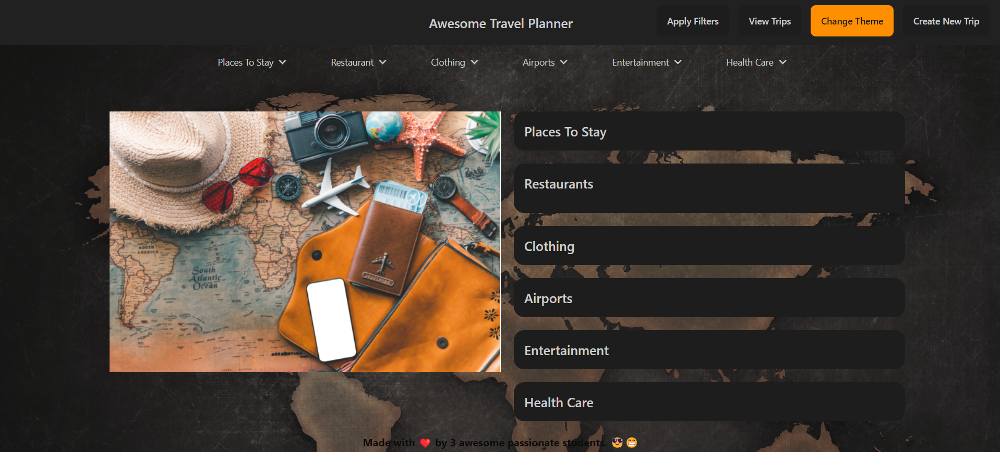
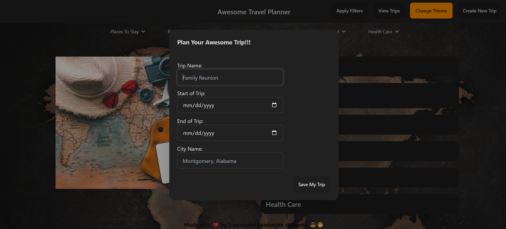
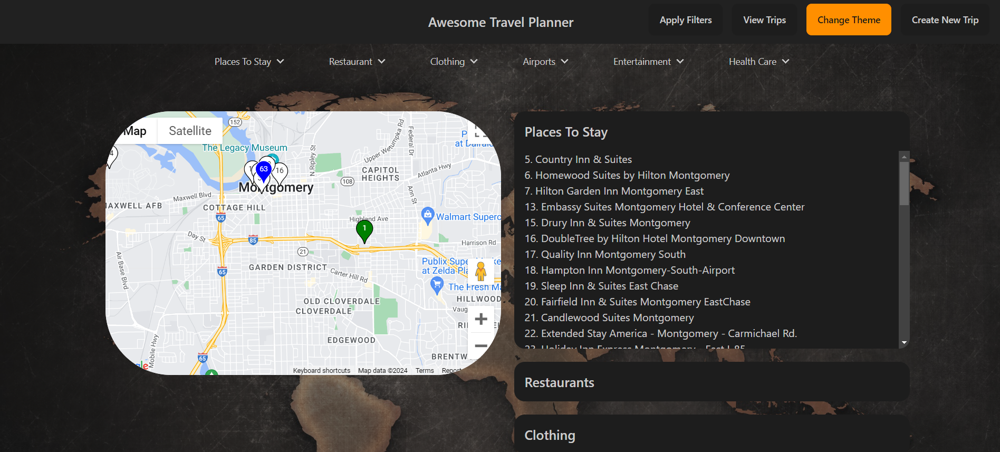
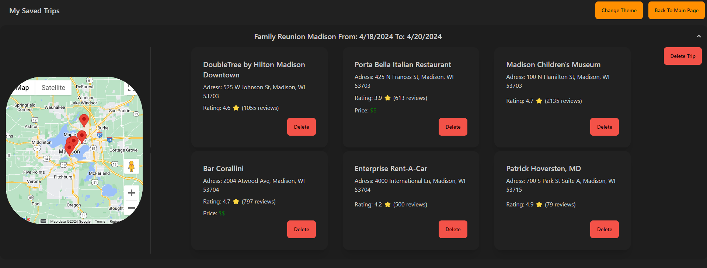

# Travel Planner

## Description

An easy to use travel planner to schedule trips and show places of interest. This website will allow you to select a city you may wish to visit, and then select certain types of places you may be intersted in visiting while there. After setting up your trip, and selecting the places you may be interested in visiting, you will be able to view the trip with a generated google map with pins for the selected places including specific details on those locations. Our website will help you in planning out your trip so you can see the best places to visit in the area by category, as well as price data and location to have the best experience on your trip.

## Usage

To begin using the website head over to our [Travel Planner](). From the landing page you will see several buttons in the nav bar, start by clicking on 'Create New Trip'. 

After clicking on the Create New Trip button you will see a form for entering the name of the trip, the start date, end date, and finally the location for where the trip is going to be.

Above the Map will be several drop down filters, slect the different categories of places you may be interested in visiting. After all desired filter options are slected click 'Apply Filters' and in a few moments the places will be listed in the space next to the map. Corisponding markers will be dropped with numbers to match the locations.

Clicking on places within the dropdown lists will highlight the selected ones yellow. After you have selected all of the places of interest you can click 'View Trips' to get a list of each of the trips you have created as well as a new map showing the location and specific details on the selected places of interest.

If after saving a trip you find there are saved places that you do not care to visit anymore, simply click the delete option on any of the displayed cards. To return and create a new trip click 'Back to Main Page'.
## Credits

This project was made with collaboration from [Ryan Hanson](https://github.com/rhansen27) and [Veysel Arslan](https://github.com/veyselarslan12) who both added greatly to the project.

API's in use are:

- [Local Business Data](https://rapidapi.com/letscrape-6bRBa3QguO5/api/local-business-data) by RapidAPI

- [Geoapify Places](https://www.geoapify.com/) by Geoapify

- [Google Maps api](https://mapsplatform.google.com/maps-products/?_gl=1*qs1w6d*_ga*MTk1MzUxODIzNy4xNzEyMjA2MjI0*_ga_NRWSTWS78N*MTcxMzQ3MzEzMy42LjEuMTcxMzQ3MzEzMy4wLjAuMA..#maps-section) Using both the API and the Maps library
